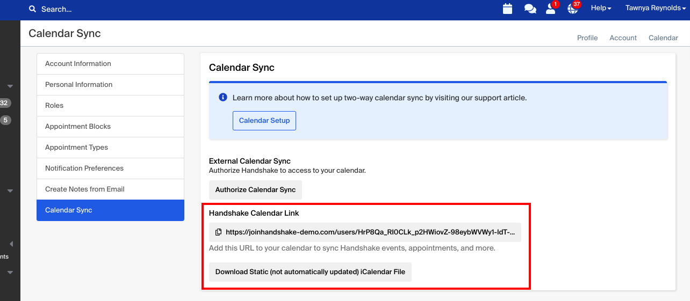
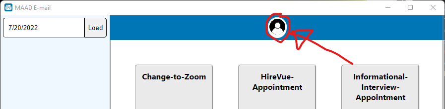
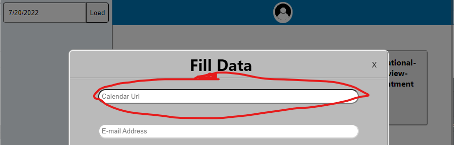

|      OS |     Link |
|--------:|---------:|
| Windows | [Download](https://github.com/AlexBerryhill/hackathon_career_center/raw/main/release-builds/windows-installer/MaadEmailAppInstaller.exe) |
|     Mac | Download |
|   Linux | Download |

## Sync from Handshake
Handshake has some good instructions [here](https://support.joinhandshake.com/hc/en-us/articles/218692818-Calendar-Sync-Options-in-Handshake) if you want to use these instructions to sync your appointments to your calenders.

### To set this up:

1. Click the main drop down menu
2. Select User Settings
3. Click Calendar Sync from the menu to the left of the page
4. Copy the link in the Calendar Export section or download a static iCalendar file
​
    - Note: a static iCalendar file will not be      automatically updated 

5. Open your user data

6. Paste your calendar link in your User Data and Submit

## How to send a Template Email

