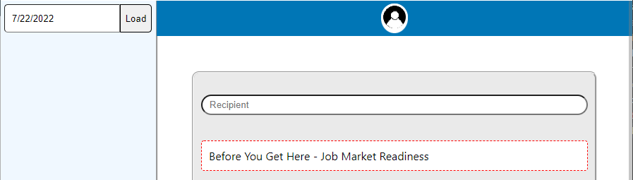
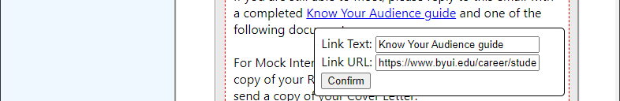

|      OS |     Link |
|--------:|---------:|
| Windows | [Download](https://github.com/AlexBerryhill/hackathon_career_center/raw/main/release-builds/windows-installer/MaadEmailAppInstaller.exe) |
|     Mac | Download |
|   Linux | Download |

## Sync from Handshake
Handshake has some good instructions [here](https://support.joinhandshake.com/hc/en-us/articles/218692818-Calendar-Sync-Options-in-Handshake) if you want to use these instructions to sync your appointments to your calenders.

### To set this up:

1. Click the main drop down menu
2. Select User Settings
3. Click Calendar Sync from the menu to the left of the page
4. Copy the link in the Calendar Export section or download a static iCalendar file
​

    - Note: a static iCalendar file will not be      automatically updated 

5. Open your user data

6. Paste your calendar link in your User Data and Submit

## How to Send a Template Email

1. Enter the date of the appointment in the top right corner
2. Select your template(If you are not on the template page click "Select Template")
3. If there are any custom changes you need can be made now. Changing links will be its own tutorial
4. Add Recipient E-mail

5. And Send

## How to Create a Template
1. Select "Create template"
2. Enter a Title
    - A title is What you see from the Select Template page
3. Enter a subject
    - This is the E-mail Subject that the recipient will see
4. Enter the main body.
    - Look at the key to the side to get items to automatically fill or create a link.
    - Note: Do not include the signature block, this is already included.
5. Select "Create"

## Editing Links
1. Select the link from the Template Preview

## How to Delete a Template
1. Select "Delete Template"
    - The Titles should now be red
2. Select the template to be deleted
    - Note: There is no confirmation message so be careful